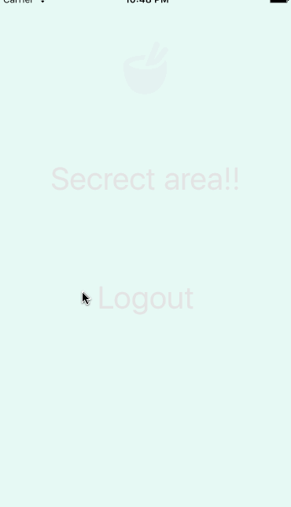

# react-natve-padlocker

Wanted to experiment ways to enter in a pin code.



## Install

`yarn add react-native-padlocker`

## Demo on expo

https://expo.io/@darryld/padlocker-demo

## Usage

```javascript
<PadLocker
    correctPin={1111}
    backgroundColor="#21ce99"
    handleAfterLock={() => console.log('Unlocked')}
    handleFailedAttempt={() => console.log('failed attempt')}
    renderMainIcon={() => <Icon name="bowl" size={70} color="white" />}
    renderBackIcon={() => <Icon name="delete" size={30} color="white" />}
    renderAfterUnlock={() => (
        <FadeIn duration={1000}>
            <Body>...</Body>
        </FadeIn>
    )}
/>
```

## Todo

* [ ] add tests
* [ ] option for different pin length
* [ ] option for background element

# License

MIT
